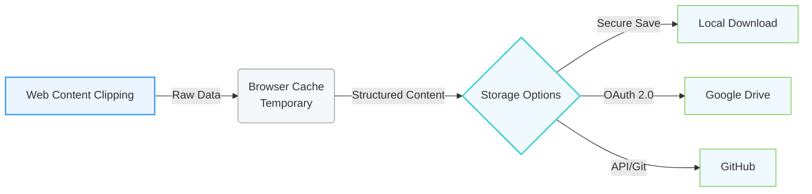

# CNotely - Cloud Content UX Layer

[中文](README_CN.md) | English

## Table of Contents

- 📁 [CNotely - Cloud Content UX Layer](#cnotely---cloud-content-ux-layer)
  - 📑 [Table of Contents](#table-of-contents)
  - 📋 [Project Overview](#project-overview)
  - ⭐ [Core Features](#core-features)
    - 🌐 [1. Web Clipping Extension](#1-web-clipping-extension)
    - 💡 [2. Knowledge Hub](#2-knowledge-hub)
    - 🔒 [3. Privacy & Security](#3-privacy--security)
      - 🛡️ [Privacy-First Architecture](#privacy-first-architecture)
      - 🔄 [Data Flow Process](#data-flow-process)
  - 📊 [Technical Specifications](#technical-specifications)
  - 📈 [How It Works](#how-it-works)
  - ❓ [Why CNotely?](#why-cnotely)
  - 🚀 [Getting Started](#getting-started)
  - 💼 [Use Cases](#use-cases)
  - 🌍 [Browser Extensions](#browser-extensions)
  - 🖥️ [Web Application](#web-application)
  - 📄 [Privacy & Terms](#privacy--terms)
  - 📧 [Contact](#contact)

## 📋 Project Overview

CNotely is a powerful Cloud Content UX Layer that transforms your GitHub and Google Drive into a professional knowledge base. It provides a seamless experience for capturing, organizing, and retrieving knowledge from the web directly to your cloud storage.

## ⭐ Core Features

### 🌐 1. Web Clipping Extension

- **One-click Rich Text/Markdown Clipping** - Capture clean content from any website
- **Intelligent Noise Removal** - Automatically strips unwanted elements
- **High-fidelity Image Preservation** - Maintains image quality during capture
- **Multi-browser Support** - Available for Chrome, Edge, and Firefox

### 💡 2. Knowledge Hub

- **Pro Rich-Text & Markdown Editor** - Dual-mode editing for different preferences
- **Instant Cloud-Index Search** - Fast and efficient content retrieval
- **Universal Document Export** - Convert notes to PDF, DOCX, HTML, MD, or TXT

### 🔒 3. Privacy & Security

#### 🛡️ Privacy-First Architecture

- **Zero-DB Architecture** - No content storage on CNotely servers
- **OAuth 2.0 Authentication** - Secure access to your cloud storage
- **Data Sovereignty** - Your cloud storage remains the single source of truth
- **No Lock-in** - Notes stored as standard .md or .html files

#### 🔄 Data Flow Process

**How it works:**

1. **Web Content Clipping** - Content is captured from websites using the browser extension
2. **Browser Cache** - Content is temporarily stored in the browser cache
3. **Storage Options** - User chooses where to store the content:
   - **Local Download** - Save directly to your computer
   - **Google Drive** - Upload to your Google Drive account
   - **GitHub** - Commit to your GitHub repository

No content is ever stored on CNotely servers. Your data remains under your control at all times.

## 📊 Technical Specifications

| Category     | Details                                         |
| ------------ | ----------------------------------------------- |
| Storage      | GitHub & Google Drive (Decentralized / Zero-DB) |
| Editing      | Dual-Mode Architecture (Rich-Text & Markdown)   |
| Privacy      | OAuth 2.0 Auth, No Content Logging              |
| Distribution | Multi-Format (PDF, DOCX, HTML, MD)              |
| Platforms    | Web, Chrome, Edge, Firefox                      |

## 📈 How It Works

1. **Knowledge Input** - Capture clean content from any site with the browser extension
2. **Knowledge Hub** - Manage your vault with a professional UI, including full-text search and rich-text editing
3. **Knowledge Output** - Export your notes to multiple formats for sharing or presentation

## ❓ Why CNotely?

- **Privacy-First Design** - Your data remains in your control at all times
- **No Database Storage** - We never store your note bodies, only handle authorization and indexing
- **Pro-Grade Publishing** - Instantly convert your thoughts into professional documents
- **Seamless Integration** - Works directly with your existing GitHub or Google Drive
- **Open Standards** - Notes stored as standard files for maximum compatibility

## 🚀 Getting Started

1. **Install the Extension** - Available for Chrome, Edge, and Firefox
2. **Connect Your Cloud Storage** - Link your GitHub or Google Drive account
3. **Start Clipping** - Capture web content with one click
4. **Manage Your Knowledge** - Organize and edit your notes in the web app
5. **Export & Share** - Convert your notes to professional formats

## 💼 Use Cases

- **Research Collection** - Gather and organize information from across the web
- **Content Creation** - Draft and refine content before publishing
- **Knowledge Management** - Build a personal or team knowledge base
- **Reference Library** - Create a searchable repository of valuable resources
- **Study Notes** - Capture and organize educational content

## 🌍 Browser Extensions

- **Chrome**: [CNotely - Save Web Content](https://chromewebstore.google.com/detail/cnotely-%E2%80%93-save-web-content/adckfinclpmhjnijmeeejkdhocikacgd)
- **Edge**: [CNotely - Save Web Content](https://microsoftedge.microsoft.com/addons/detail/bdcofhehaohhfckpelmkkpmigoemecpp)
- **Firefox**: [CNotely](https://addons.mozilla.org/en-US/firefox/addon/cnote/)

## 🖥️ Web Application

Access the full CNotely experience at [app.cnotely.com](https://app.cnotely.com)

## 📄 Privacy & Terms

- **Privacy Policy**: [https://app.cnotely.com/privacy-policy](https://app.cnotely.com/privacy-policy)
- **Terms of Service**: [https://app.cnotely.com/terms-of-service](https://app.cnotely.com/terms-of-service)

## 💬 Feedback & Support

* **Feedback**: For suggestions or bugs, please create an [Issue](https://github.com/itcwc/cnotely-info/issues) here.
* **Support**: Email us at [support@cnotely.com](mailto:support@cnotely.com).

---

© 2026 CNotely Cloud UX Layer

*No Database. No Lock-in. Your Knowledge, Your Control.*
