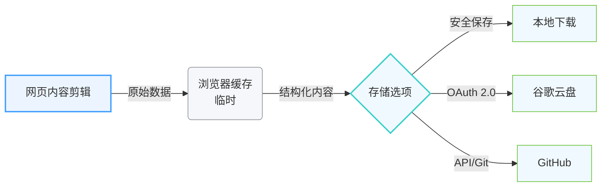

# cnotely - 云内容用户体验层

[English](README.md)

## 目录

- 📋 [项目概述](#-项目概述)
- ⭐ [核心功能](#-核心功能)
  - 🌐 [1. 网页剪辑扩展](#-1-网页剪辑扩展)
  - 💡 [2. 知识中心](#-2-知识中心)
  - 🔒 [3. 隐私与安全](#-3-隐私与安全)
    - 🛡️ [隐私优先架构](#-隐私优先架构)
    - 🔄 [数据流程](#-数据流程)
- 📊 [技术规格](#-技术规格)
- 📈 [工作原理](#-工作原理)
- ❓ [为什么选择 cnotely？](#-为什么选择-cnotely)
- 🚀 [开始使用](#-开始使用)
- 💼 [使用场景](#-使用场景)
- 🌍 [浏览器扩展](#-浏览器扩展)
- 🖥️ [网页应用](#-网页应用)
- 📄 [隐私与条款](#-隐私与条款)
- 📧 [联系我们](#-联系我们)

## 📋 项目概述

cnotely 是一个强大的云内容用户体验层，将您的 GitHub 和 Google Drive 转变为专业知识库。它提供了无缝的体验，用于从网络捕获、组织和检索知识，直接存储到您的云存储中。

## ⭐ 核心功能

### 🌐 1. 网页剪辑扩展

- **一键富文本/Markdown 剪辑** - 从任何网站捕获干净的内容
- **智能噪音移除** - 自动去除不需要的元素
- **高保真图像保存** - 在捕获过程中保持图像质量
- **多浏览器支持** - 适用于 Chrome、Edge 和 Firefox

### 💡 2. 知识中心

- **专业富文本 & Markdown 编辑器** - 双模式编辑，满足不同偏好
- **即时云索引搜索** - 快速高效的内容检索
- **通用文档导出** - 将笔记转换为 PDF、DOCX、HTML、MD 或 TXT

### 🔒 3. 隐私与安全

#### 🛡️ 隐私优先架构

- **零数据库架构** - cnotely 服务器上无内容存储
- **OAuth 2.0 认证** - 安全访问您的云存储
- **数据主权** - 您的云存储始终是唯一的真实来源
- **无锁定** - 笔记以标准 .md 或 .html 文件形式存储

#### 🔄 数据流程

**工作原理：**

1. **网页内容剪辑** - 使用浏览器扩展从网站捕获内容
2. **浏览器缓存** - 内容临时存储在浏览器缓存中
3. **存储选项** - 用户选择存储位置：
   - **本地下载** - 直接保存到您的计算机
   - **谷歌云盘** - 上传到您的 Google Drive 账户
   - **GitHub** - 提交到您的 GitHub 仓库

内容永远不会存储在 cnotely 服务器上。您的数据始终在您的控制之下。

## 📊 技术规格

| 类别 | 详情                                         |
| ---- | -------------------------------------------- |
| 存储 | GitHub 和 Google Drive (去中心化 / 无数据库) |
| 编辑 | 双模式架构 (富文本和 Markdown)               |
| 隐私 | OAuth 2.0 认证，无内容日志                   |
| 分发 | 多格式 (PDF, DOCX, HTML, MD)                 |
| 平台 | Web, Chrome, Edge, Firefox                   |

## 📈 工作原理

1. **知识输入** - 使用浏览器扩展从任何网站捕获干净的内容
2. **知识中心** - 使用专业界面管理您的库，包括全文搜索和富文本编辑
3. **知识输出** - 将您的笔记导出为多种格式，用于分享或展示

## ❓ 为什么选择 cnotely？

- **隐私优先设计** - 您的数据始终在您的控制之下
- **无数据库存储** - 我们从不存储您的笔记内容，只处理授权和索引
- **专业级发布** - 立即将您的想法转换为专业文档
- **无缝集成** - 直接与您现有的 GitHub 或 Google Drive 配合使用
- **开放标准** - 笔记以标准文件形式存储，实现最大兼容性

## 🚀 开始使用

1. **安装扩展** - 适用于 Chrome、Edge 和 Firefox
2. **连接您的云存储** - 链接您的 GitHub 或 Google Drive 账户
3. **开始剪辑** - 一键捕获网页内容
4. **管理您的知识** - 在网页应用中组织和编辑您的笔记
5. **导出和分享** - 将您的笔记转换为专业格式

## 💼 使用场景

- **研究收集** - 从网络各处收集和组织信息
- **内容创作** - 在发布前起草和完善内容
- **知识管理** - 构建个人或团队知识库
- **参考库** - 创建可搜索的宝贵资源库
- **学习笔记** - 捕获和组织教育内容

## 🌍 浏览器扩展

- **Chrome**: [cnotely - 保存网页内容](https://chromewebstore.google.com/detail/cnotely-%E2%80%93-save-web-content/adckfinclpmhjnijmeeejkdhocikacgd)
- **Edge**: [cnotely - 保存网页内容](https://microsoftedge.microsoft.com/addons/detail/bdcofhehaohhfckpelmkkpmigoemecpp)
- **Firefox**: [cnotely](https://addons.mozilla.org/en-US/firefox/addon/cnote/)

## 🖥️ 网页应用

在 [app.cnotely.com](https://app.cnotely.com) 访问完整的 cnotely 体验

## 📄 隐私与条款

- **隐私政策**: [https://app.cnotely.com/privacy-policy](https://app.cnotely.com/privacy-policy)
- **服务条款**: [https://app.cnotely.com/terms-of-service](https://app.cnotely.com/terms-of-service)

## 💬 反馈与支持

- **反馈**: 如有建议或发现 bug，请在此创建 [Issue](https://github.com/itcwc/cnotely-info/issues)。
- **支持**: 请发送电子邮件至 [support@cnotely.com](mailto:support@cnotely.com)。

---

© 2026 cnotely 云用户体验层

*无数据库。无锁定。您的知识，您的控制。*
